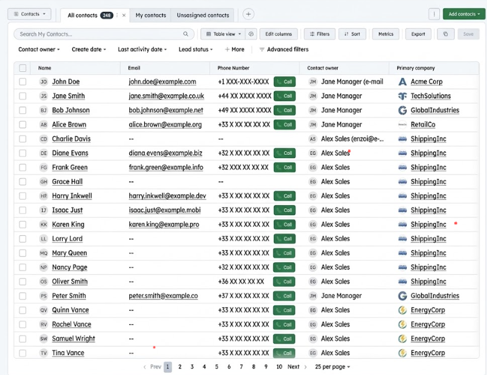

# Click-to-Call with Google Voice

A professional-grade Google Chrome extension (Manifest V3) designed to streamline your calling workflow by automatically transforming phone numbers on any webpage into clickable **Google Voice** links. 

> **⚡ Optimized for HubSpot:** While it works globally, this extension provides deep, specialized integration for HubSpot CRM to boost sales productivity.

---

### ☕ Support the Project
If this extension saves you time and makes your HubSpot workflow smoother, feel free to support its development!

---

### 💬 Feedback & Community
Got a question, found a bug, or have a suggestion? Or maybe you just want to say hello? 
Join the conversation on [**GitHub Discussions**](https://github.com/austrasien/chrome_extension-click_to_call/discussions)! 

Your feedback is invaluable in making this extension better for everyone.

---

## 🚀 Overview

This extension scans the webpages you visit for phone numbers and converts them into direct links to Google Voice. It eliminates the need for manual dialing or copy-pasting, opening a direct communication channel in a new tab instantly.

> **Note:** This extension is specifically designed for **Google Voice Workspace (Pro)** accounts.

## ✨ Key Features

### 🛠 Deep HubSpot Integration
- **Intelligent Side-Panel Redirection:** Automatically identifies the active contact in HubSpot's preview panels or contact cards and redirects you to the correct record with `interaction=logged-call` enabled.
- **Uniform Table Layout:** Adds a consistent, green styled "📞 Call" button to the right of phone numbers in HubSpot contact tables using a robust Flexbox layout.
- **Engagement Triggering:** Intercepts native HubSpot "Call" buttons to ensure calls are logged against the correct CRM record.

### 🔍 Universal Detection & Smart Filtering
- **Linkification:** Detects both standard `tel:` links and plain text phone numbers.
- **Heuristic Validation:** Uses advanced filtering to ignore false positives like IDs, invoice numbers, or SKU codes (filtering by length, context keywords, and character patterns).
- **Default Country Prefix:** Automatically prepends **`+33`** (France) to local numbers starting with `0` if no country code is present.

### 🌍 Internationalization (i18n)
Full support for multiple languages. The interface automatically adapts to your browser settings:
- **English** (Call)
- **French** (Appeler)
- **Spanish** (Llamar)

### 🏎 Performance & Stability
- **Non-Intrusive:** Opens all links in a new tab (`target="_blank"`) to preserve your current workflow.
- **High Responsiveness:** Uses an optimized Mutation Observer with a **50ms debounce** to detect new content instantly without impacting CPU usage.
- **Context Awareness:** Engineered to handle extension reloads without crashing or polluting the browser console.

## 🛠 Installation Guide

Follow these simple steps to install the extension in your Google Chrome browser:

1.  **Download the Extension:**
    - Scroll to the top of this page.
    - Click the green **"<> Code"** button.
    - Select **"Download ZIP"** from the menu.
2.  **Extract the Files:**
    - Find the downloaded `.zip` file on your computer (usually in your "Downloads" folder).
    - Right-click it and select **"Extract All..."** (or "Unzip") to a folder of your choice.
3.  **Open Chrome Extensions Page:**
    - Open Google Chrome.
    - Type `chrome://extensions/` in the address bar and press **Enter**.
4.  **Enable Developer Mode:**
    - Look for the **"Developer mode"** switch in the top right corner of the page.
    - **Turn it ON**.
5.  **Load the Extension:**
    - Click the **"Load unpacked"** button that appeared in the top left corner.
    - A file browser will open. Navigate to the folder where you unzipped the files in Step 2.
    - **Important:** Select the folder that contains the `manifest.json` file.
6.  **Final Step:**
    - The extension is now active! 
    - **Go back to your HubSpot tabs** (or any other webpage) and **refresh the page (F5)** to enable the calling buttons.

## 📖 How it Works

The background script (`content.js`) performs the following steps:
1.  **Scans the DOM** using a specialized TreeWalker to find text nodes and phone fields.
2.  **Validates** potential numbers against exclusion lists (ID, Ref, SKU, Batch, etc.).
3.  **Sanitizes** strings and encodes the `+` prefix for Google Voice compatibility.
4.  **Injects** styled buttons or wraps text in high-priority green links (`#0b8043`).

## ⚖️ License

Licensed under the **MIT License**. Permissive for both personal and commercial use, provided attribution is maintained.

---
*Developed to bridge the gap between HubSpot CRM and Google Voice Pro.*
